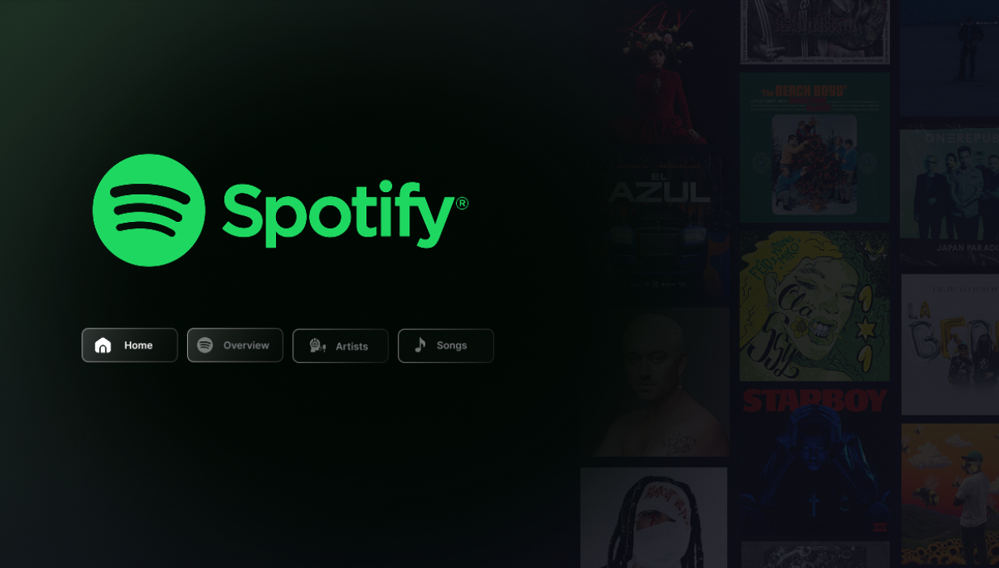
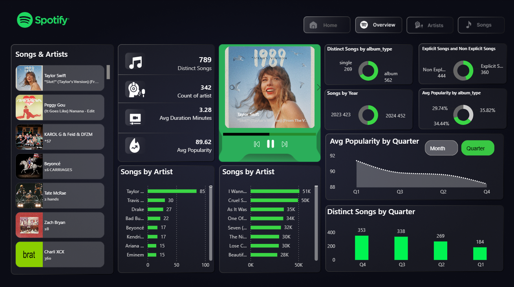
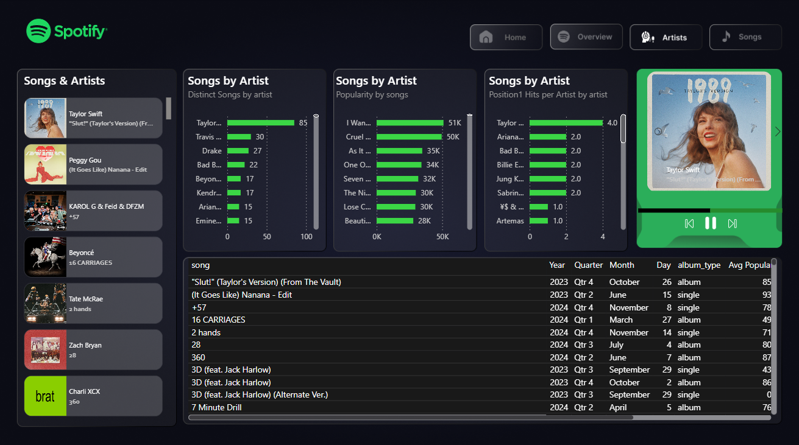
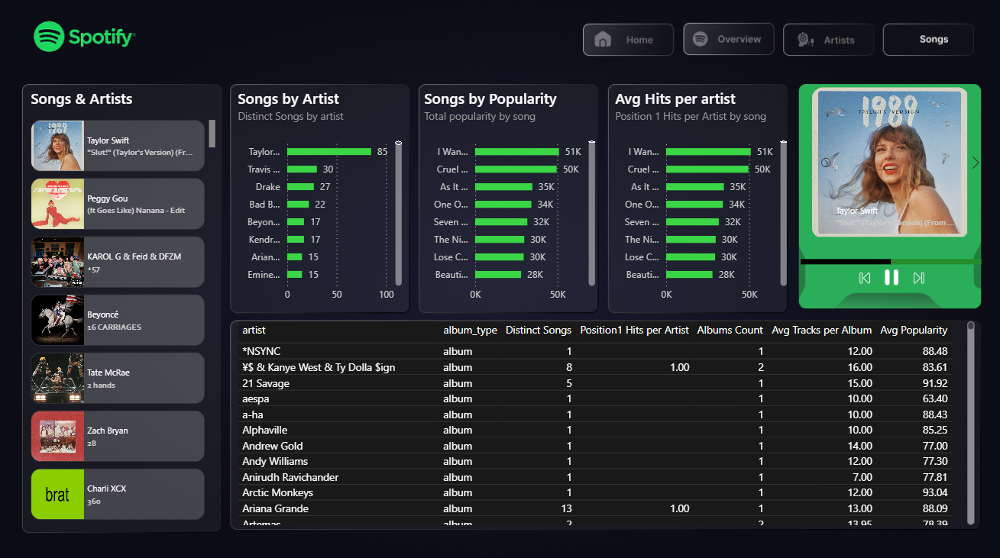

# Spotify Dash board

# 🎵 Spotify Top 50 World — Power BI Dashboard

## 📊 Project Overview

This project is an interactive Power BI dashboard designed to analyze Spotify's Top 50 World music data. It provides insights into songs, artists, popularity, and music trends through interactive visualizations.

## 🛠️ Tools & Technologies

- Power BI
- DAX
- Data Visualization
- Data Analysis

## 📌 Dashboard Pages

### 1. Home
An introductory dashboard page providing an overview of the project.

### 2. Overview
Explores overall music performance and key analytical metrics.

### 3. Artists
Analyzes artist-related performance and music trends.

### 4. Songs
Explores song-level information and popularity patterns.

## ✨ Key Features

- Interactive dashboard navigation
- Data visualization using Power BI
- KPI cards and analytical visuals
- Music and artist performance analysis
- User-friendly dashboard design

## 🖼️ Dashboard Preview

### Home

### Overview

### Artists

### Songs

## 🎯 Project Objective

The objective of this project is to analyze Spotify Top 50 World data and transform raw music data into meaningful visual insights using Power BI.

## 👤 Author

**Tejasvi**

Data Analyst | Power BI | SQL | Excel
